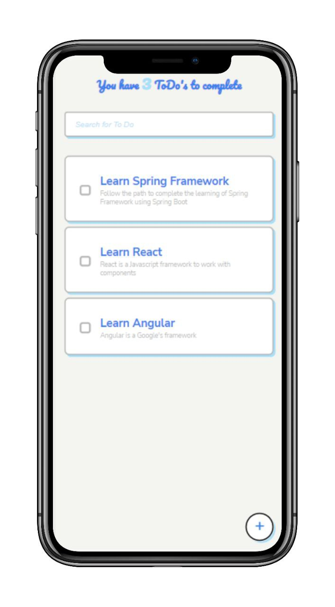
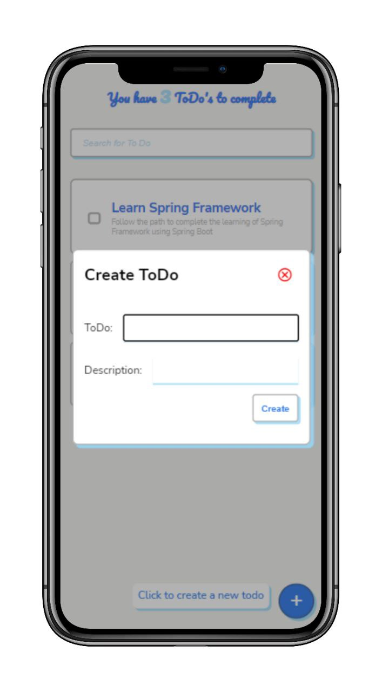
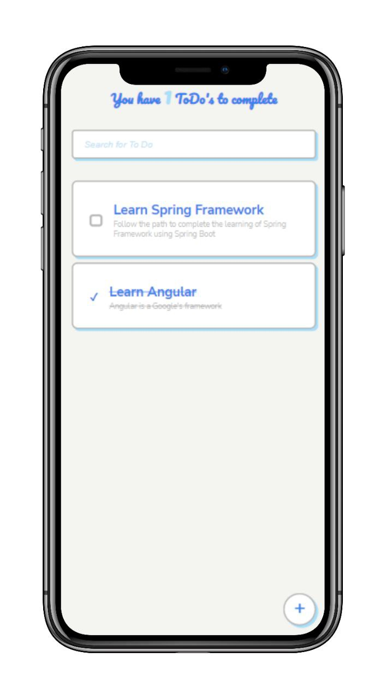
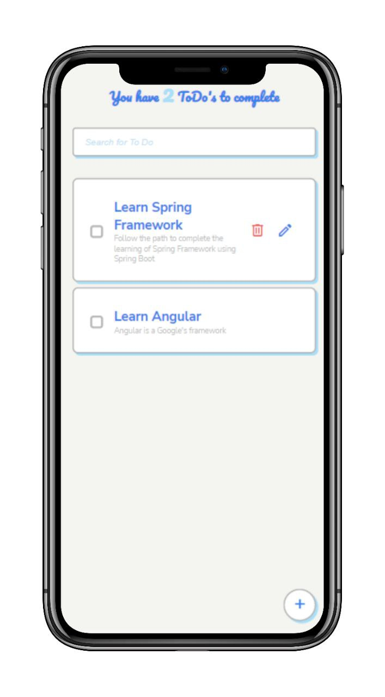
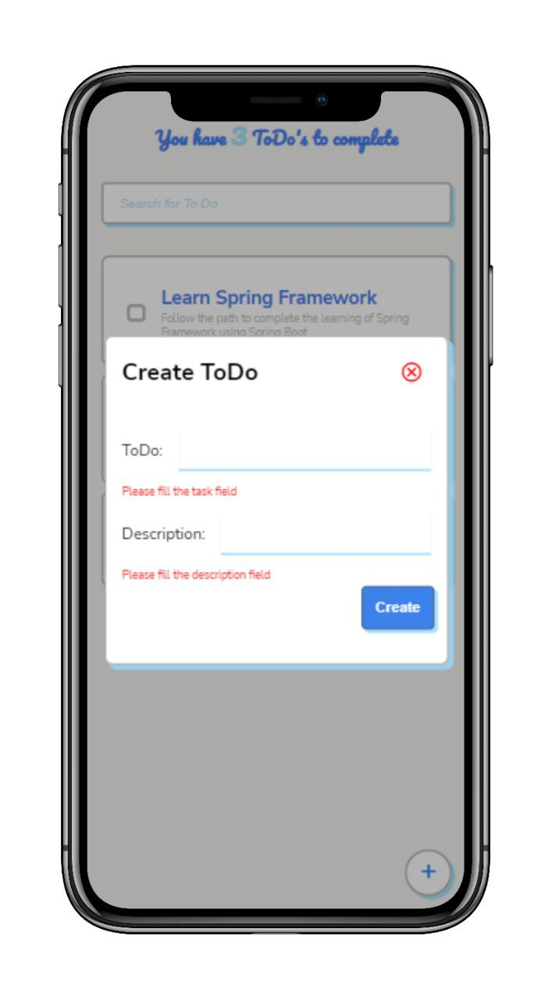
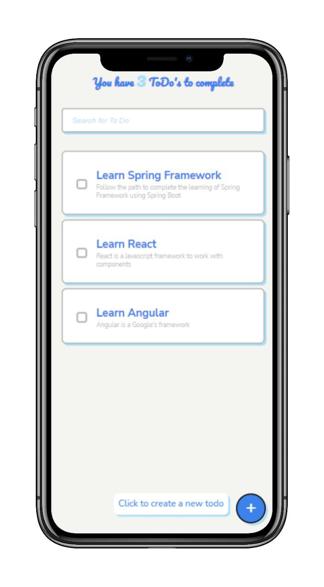
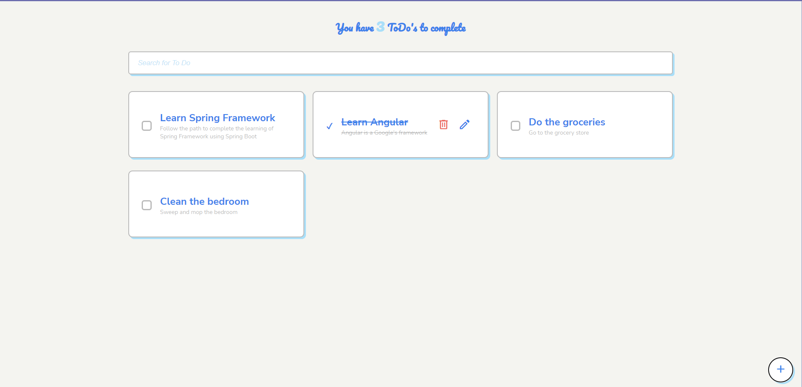

# ToDo **React** App

Hello! :wave: 
I'm Leonardo Perdomo, **React Frontend Developer**, and this is a ToDO application developed with Create React App. 

This project was made with the purpose of learning and practicing React, and it's a simple ToDo application that allows you to add, edit, delete and mark as completed tasks.

The Backend is developed with Java and Spring Boot, and will be available soon in my GitHub profile.

## Getting Started

In the project directory, you can run: `npm start` or `yarn start` to run the app in the development mode. Open [http://localhost:3000](http://localhost:3000) to view it in the browser.

The page will reload if you make edits. You will also see any lint errors in the console.

## Technologies used

- React
- JavaScript
- HTML
- CSS

### Conventions 

- BEM (Block Element Modifier)
- Atomic Design
- Mobile First

## Captures

### Mobile Version

#### Main Page

#### Add Task

#### Completed Task

#### Delete Task

#### Validation Form

#### Button Tooltip

### Desktop Version

#### Main Page

## Installing

To install the project, you can run: `npm install` or `yarn install` to install all the dependencies. 

## Built With

- [React](https://reactjs.org/) - The web framework used to build the app. 
- [Create React App] 

## Author

- **Leonardo Perdomo** - [GitHub](https://github.com/leonardoapd) - [LinkedIn](https://www.linkedin.com/in/leonardo-perdomo-duran/)

## License

This project is licensed under the MIT License - see the [LICENSE.md](LICENSE.md) file for details

## Acknowledgments

- Hat tip to anyone whose code was used
- Inspiration

